# Command Pattern Implementation - Fruit Stock Management System

## 📚 Introduction
Welcome to this practical implementation of the **Command Design Pattern** in C#! This repository showcases a fruit stock management system that demonstrates how to effectively use the Command Pattern to create flexible, maintainable, and decoupled code. The Command Pattern is a behavioral design pattern that transforms requests into stand-alone objects, enabling parameterization, queuing, logging, and undo operations.

## 🏷️ Category
**Behavioral Design Pattern**

Behavioral patterns are concerned with algorithms and the assignment of responsibilities between objects. They describe not just patterns of objects or classes but also the patterns of communication between them.

## 📊 Architecture Overview


## 🎯 Pattern Purpose
The Command Pattern elegantly addresses several software design challenges:

### **Primary Goals:**
1. **Encapsulation**: Turns requests into objects containing all necessary information
2. **Decoupling**: Separates the invoker from the receiver of a request
3. **Flexibility**: Enables parameterization of objects with operations
4. **Extensibility**: Supports undo/redo, logging, and transactional operations

### **Problem it Solves:**
- Tight coupling between request senders and receivers
- Difficulty in implementing undo/redo functionality
- Complex request queuing and scheduling requirements
- Need for audit trails or command logging

## 🔄 Flow of Execution

```mermaid
flowchart TD
    A[Client: Program.cs] --> B[1. Create Receiver<br>FruitStock instance]
    A --> C[2. Create Invoker<br>FruitShop instance]
    
    B --> D[3. Create Commands<br>BuyFruitCommand, SellFruitCommand]
    C --> E[4. Add Commands to Invoker<br>shop.AddCommand command]
    
    D --> E
    
    E --> F[5. Execute Commands<br>shop.ExecuteCommands]
    
    F --> G{Command Type?}
    G -->|Buy Command| H[BuyFruitCommand.Execute]
    G -->|Sell Command| I[SellFruitCommand.Execute]
    
    H --> J[Receiver: stock.AddFruit]
    I --> K[Receiver: stock.SellFruit]
    
    J --> L[6. Display Results<br>stock.DisplayStock]
    K --> L
    
    L --> M[✅ Operation Complete]
    
    style A fill:#e1f5fe
    style B fill:#f3e5f5
    style C fill:#f3e5f5
    style D fill:#fff3e0
    style E fill:#e8f5e8
    style F fill:#ffecb3
    style G fill:#ffccbc
    style H fill:#c8e6c9
    style I fill:#ffcdd2
    style J fill:#f0f4c3
    style K fill:#f0f4c3
    style L fill:#d1c4e9
    style M fill:#b9f6ca
```



## 🏗️ Implementation Components

### **1. Receiver (`FruitStock`)**
The business logic component that knows how to perform the actual operations:
```csharp
class FruitStock
{
    private Dictionary<string, int> stock = new Dictionary<string, int>();
    
    public void AddFruit(string fruit, int quantity) { /* Implementation */ }
    public void SellFruit(string fruit, int quantity) { /* Implementation */ }
    public void DisplayStock() { /* Implementation */ }
}
```

### **2. Command Interface (`ICommand`)**
The contract that all commands must follow:
```csharp
interface ICommand
{
    void Execute();
}
```

### **3. Concrete Commands (`BuyFruitCommand`, `SellFruitCommand`)**
Encapsulated requests that bind actions to receivers:
```csharp
class BuyFruitCommand : ICommand
{
    private FruitStock stock;
    private string fruit;
    private int quantity;
    
    public void Execute()
    {
        stock.AddFruit(fruit, quantity);
    }
}
```

### **4. Invoker (`FruitShop`)**
Controls command execution and can manage command queues:
```csharp
class FruitShop
{
    private List<ICommand> commands = new List<ICommand>();
    
    public void AddCommand(ICommand command) { /* Add to queue */ }
    public void ExecuteCommands() { /* Execute all queued commands */ }
}
```

### **5. Client (`Program`)**
Orchestrates the pattern by creating and configuring components:
```csharp
class Program
{
    static void Main()
    {
        // Setup
        FruitStock stock = new FruitStock();
        FruitShop shop = new FruitShop();
        
        // Create commands
        ICommand buyApples = new BuyFruitCommand(stock, "Apples", 10);
        
        // Queue commands
        shop.AddCommand(buyApples);
        
        // Execute
        shop.ExecuteCommands();
    }
}
```

## 🚀 Getting Started

### **Prerequisites**
- .NET SDK (10.0 or higher)
- Git

### **Installation & Execution**
```bash
# Clone the repository
git clone https://github.com/Vineet-Sharma-Microsoft/Command-Pattern.git

# Navigate to project directory
cd Command-Pattern

# Run the application
dotnet run
```

### **Expected Output**
```
Added 10 Apple(s) to the stock.
Added 5 Banana(s) to the stock.
Sold 3 Apple(s).
Current Stock:
Apples: 7
Bananas: 5
```

## 💡 Key Benefits & Use Cases

### **Advantages:**
1. **Single Responsibility Principle**: Separates invocation logic from business logic
2. **Open/Closed Principle**: New commands can be introduced without changing existing code
3. **Undo/Redo Implementation**: Commands can store state for reversal
4. **Command Queuing**: Operations can be scheduled for later execution
5. **Command Logging**: All operations can be logged for auditing
6. **Macro Commands**: Complex operations can be composed from simple ones

### **Real-World Applications:**
- **GUI Applications**: Button clicks, menu actions
- **Transaction Systems**: Database operations with rollback capability
- **Task Schedulers**: Job queues and batch processing
- **Undo/Redo Systems**: Text editors, graphic applications
- **Remote Controls**: Home automation, IoT devices

## 🛠️ Extension Ideas

### **1. Undo/Redo Functionality**
```csharp
interface ICommand
{
    void Execute();
    void Undo();  // Add undo capability
}

class BuyFruitCommand : ICommand
{
    public void Undo()
    {
        stock.SellFruit(fruit, quantity);
    }
}
```

### **2. Command Logging**
```csharp
class LoggingFruitShop : FruitShop
{
    private List<string> commandLog = new List<string>();
    
    public void AddCommand(ICommand command, string description)
    {
        commandLog.Add($"{DateTime.Now}: {description}");
        base.AddCommand(command);
    }
}
```

### **3. Transaction Support**
```csharp
public void ExecuteCommandsWithRollback()
{
    var executedCommands = new List<ICommand>();
    
    foreach (var command in commands)
    {
        try
        {
            command.Execute();
            executedCommands.Add(command);
        }
        catch
        {
            // Rollback all executed commands
            executedCommands.Reverse();
            foreach (var cmd in executedCommands)
            {
                if (cmd is IUndoable undoable)
                    undoable.Undo();
            }
            throw;
        }
    }
}
```

### **4. Macro Commands**
```csharp
class MacroCommand : ICommand
{
    private List<ICommand> commands = new List<ICommand>();
    
    public void AddCommand(ICommand command)
    {
        commands.Add(command);
    }
    
    public void Execute()
    {
        foreach (var command in commands)
        {
            command.Execute();
        }
    }
}
```

## 📖 Learning Resources

### **Official Documentation**
- **GitHub Repository**: [https://github.com/Vineet-Sharma-Microsoft/Command-Pattern.git](https://github.com/Vineet-Sharma-Microsoft/Command-Pattern.git)
- **Design Patterns Guide**: [Demystifying Design Patterns in .NET: A Comprehensive Guide](https://medium.com/@mvineetsharma/demystifying-design-patterns-in-net-a-comprehensive-guide-69347789a6f9)

### **Related Patterns**
- **Composite Pattern**: Useful for creating macro commands
- **Memento Pattern**: Can be combined for undo functionality
- **Observer Pattern**: Useful for notifying about command execution
- **Chain of Responsibility**: Can work with Command for command processing pipelines

## 🧪 Testing the Pattern

### **Sample Test Scenarios:**
1. **Basic Command Execution**: Verify commands execute correctly
2. **Command Queuing**: Test multiple commands in sequence
3. **Error Handling**: Test insufficient stock scenarios
4. **Stock Verification**: Ensure stock counts are accurate
5. **Command Isolation**: Verify commands don't interfere with each other

### **Test Code Example:**
```csharp
// Unit test example
[Test]
public void TestBuyFruitCommand()
{
    var stock = new FruitStock();
    var command = new BuyFruitCommand(stock, "Apples", 10);
    
    command.Execute();
    
    // Verify stock was updated
    Assert.AreEqual(10, GetStockCount(stock, "Apples"));
}
```

## 🤝 Contributing

Feel free to fork this repository and extend the implementation. Some suggested improvements:

1. Add more command types (RestockCommand, DiscountCommand, etc.)
2. Implement persistence layer for command logging
3. Create a GUI interface for the fruit shop
4. Add unit tests for all components
5. Implement command history with undo/redo

## 📄 License & Acknowledgments

This implementation is provided for educational purposes to help developers understand the Command Design Pattern. The code is open for learning and experimentation.

**Author**: Vineet Sharma  
**Repository**: [Command-Pattern.git](https://github.com/Vineet-Sharma-Microsoft/Command-Pattern.git)  
**Reference Article**: [Demystifying Design Patterns in .NET](https://medium.com/@mvineetsharma/demystifying-design-patterns-in-net-a-comprehensive-guide-69347789a6f9)

---

## 🎓 Summary

The Command Pattern provides a robust framework for handling requests in a flexible, decoupled manner. This fruit shop example demonstrates how to:

1. **Encapsulate requests** as objects
2. **Decouple senders from receivers**
3. **Support command queuing** and batch execution
4. **Create extensible systems** that can easily add new commands
5. **Build foundations** for advanced features like undo/redo and auditing

By mastering this pattern, you'll be better equipped to design systems that are maintainable, testable, and ready for future requirements.

---
*"The Command Pattern turns requests into objects, allowing you to parameterize clients with different requests, queue or log requests, and support undoable operations." - Design Patterns: Elements of Reusable Object-Oriented Software*

**Happy Coding! 🚀**
